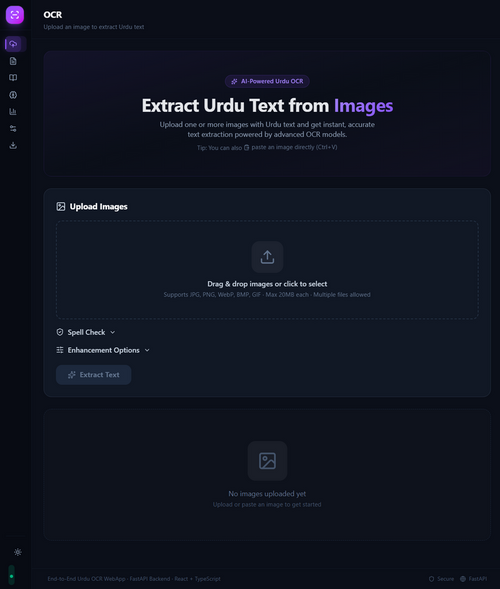
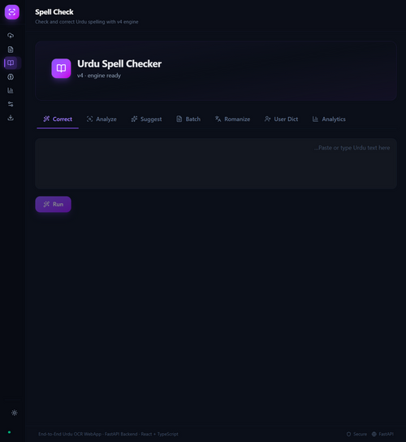
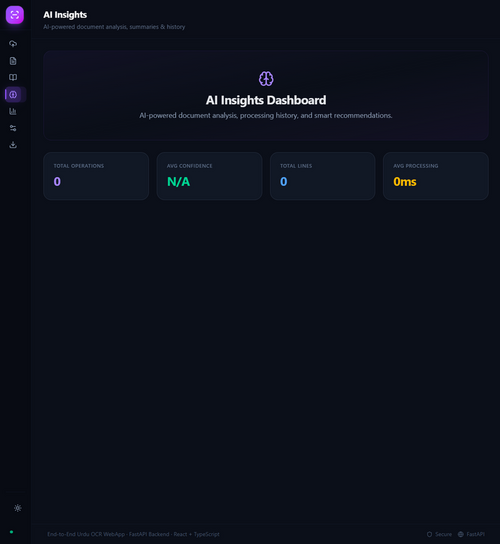
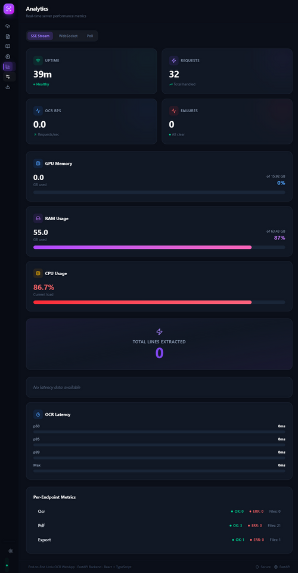
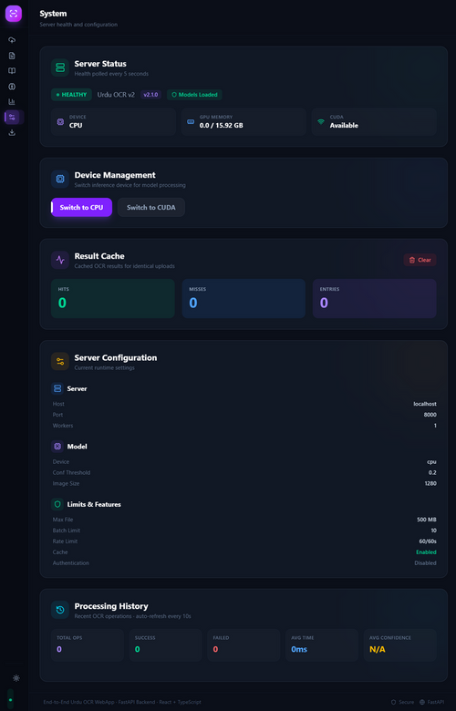

# 🌙 Urdu OCR — End-to-End Document Intelligence Platform

Today we're launching **Urdu OCR** — an open-source web app for extracting, correcting, analyzing, and exporting Urdu text from images and PDFs in one unified interface.

Powered by UTRNet + YOLOv8 deep learning models with built-in Urdu spell checking, AI-powered analysis, and multi-format export.

[](https://fastapi.tiangolo.com/) [](https://react.dev/) [](https://www.python.org/)

---

## Quickstart

### Backend Setup

```bash
cd backend
pip install -r requirements.txt
./download-models.sh   # Downloads trained models from Hugging Face
./start-server.sh
# or: uvicorn v2.main:app --host 0.0.0.0 --port 8000 --reload
```

**Models downloaded by `download-models.sh`:**
- `yolov8m_UrduDoc.pt` — YOLOv8 object detection model for text region localization
- `best_norm_ED.pth` — UTRNet character recognition model trained on Urdu documents

### Frontend Setup

```bash
cd frontend
npm install
npm run dev
```

Open `http://localhost:5174` in your browser and start extracting Urdu text from any image or PDF.

**Interactive API docs are available at** `/docs` **on the backend (Swagger UI) and** `/redoc`. Explore all 30+ endpoints with live test forms!

### Docker Quickstart

Run the entire stack with a single command:

```bash
docker compose up --build
```

This starts both the backend (`:8000`) and frontend (`:80`, proxied via nginx). For development with live reload:

```bash
# The override file is applied automatically — mounted volumes + Vite dev server
docker compose -f docker-compose.yml -f docker-compose.override.yml up --build
```

**Compose services:**

| Service | Port | Purpose |
|---|---|---|
| `backend` | 8000 | FastAPI server (UTRNet + YOLOv8) |
| `frontend` | 80 | React app served by nginx, proxying `/api/*` → backend |

**Configurable via env vars:**

| Variable | Default | Description |
|---|---|---|
| `OCR_DEVICE` | `auto` | `cpu`, `cuda`, or `auto` |
| `OCR_WORKERS` | `1` | Uvicorn worker count |
| `OCR_LOG_LEVEL` | `INFO` | Logging verbosity |
| `OCR_CACHE_ENABLED` | `true` | Result cache toggle |
| `OCR_RATE_LIMIT_ENABLED` | `true` | Rate limiting toggle |

> **Tip:** In development, `docker-compose.override.yml` mounts source directories as volumes so changes hot-reload instantly.

---

## MCP Server

A bundled [MCP](https://modelcontextprotocol.io/) (Model Context Protocol) server lives in `mcp-server/` — it exposes **42 tools**, **3 resources**, and **15 prompts** that wrap the entire Urdu OCR backend API. Use it in Claude Desktop, VS Code, or any MCP-compatible client.

```bash
cd mcp-server
pip install -e .
uv run server
```

**What's available:**
- **OCR tools** — `ocr_single`, `ocr_batch`, `ocr_with_enhance`, `ocr_direct_tensor`
- **PDF tools** — `pdf_info`, `pdf_extract`, `pdf_reconstruct`, `pdf_ocr`
- **Export tools** — JSON, TXT, CSV, DOCX, searchable PDF (both single-image and PDF OCR results)
- **Spell check tools** — auto-correct, analyze, suggest, batch, romanize, user dictionary
- **Analysis tools** — document analysis, summarization, table detection, enhancement recommendations
- **System tools** — health check, stats, device switching, cache management, config dump
- **Workflow prompts** — `ocr_workflow`, `spell_check_workflow`, `pdf_ocr_workflow`, `document_quality_audit`, `export_pipeline` and more

For a full tool reference and Claude Desktop setup guide, see [`mcp-server/README.md`](mcp-server/README.md).

---

## Features

### Image & PDF OCR
Upload images or PDFs via drag-and-drop or click. YOLOv8 detects text regions, UTRNet recognizes Urdu characters within each region. Supports JPG, PNG, BMP, TIFF, WebP, GIF, SVG inputs with full multi-page PDF processing.

Real-time per-page progress tracking with WebSocket-powered live updates and ETA estimation during long PDFs.

### Smart Image Enhancement
Pre-process images before OCR with toggleable filters — auto-contrast, sharpen, denoise, background normalization, saturation boost, blur removal. Fine-tune with sliders for brightness, contrast, gamma, and edge enhancement intensity.

Better preprocessing means significantly higher extraction accuracy on low-quality documents.

### Urdu Spell Check
Comprehensive spell checking with six dedicated tools: auto-correct, text analysis, word-level suggestions, batch correction, Roman transcription, and a customizable user dictionary.

Multi-strategy engine combining character confusion tables, Levenshtein distance, phonetic matching, compound word decomposition, n-gram language modeling, and a final UrduHack pass.

### AI-Powered Analysis
Post-OCR auto-analysis includes Urdu language detection, document type classification (receipt, letter, form, table, handwritten), extractive text summarization with keyword extraction, and automatic table structure detection in OCR output.

Every extraction comes with confidence histograms per detected line so you can gauge quality at a glance.

### Multi-Format Export
Export extracted text as TXT, JSON, CSV, Word (.docx), or searchable PDF with embedded invisible text layer. Output adapts intelligently based on your input type — image or PDF — with format-aware recommendations and one-click download.

PDF OCR results include per-page breakdowns with page-number separators.

### Monitoring & Control
Real-time health dashboard, live API metrics, cache statistics, dynamic CPU ↔ CUDA device switching without restart, and full processing history with timestamps, line counts, and confidence stats.

Prometheus-compatible metrics auto-instrument every endpoint — request counts, latency histograms, success/failure rates, RPS tracking.

---

## Workflow

Here is a typical workflow to get you started:

1. Download trained models (`cd backend && ./download-models.sh`) and launch the backend (`./start-server.sh`).
2. Go to the **OCR** tab — drag-and-drop an Urdu image or PDF for text extraction.
3. Toggle **image enhancements** if your source is low quality, then hit Extract.
4. Review extracted text with confidence bars; fix errors via the built-in **Spell Check** panel.
5. Export to TXT, JSON, CSV, DOCX, or searchable PDF with one click.

Need more? Jump to any tab — **PDF** for multi-page docs, **Spell Check** for dedicated correction workflows, **Export** for format options, or **System** for monitoring and server config.

---

## 🖼️ App Showcase

### OCR Page — Drag, Drop, Extract in Seconds
Upload images or PDFs with drag-and-drop. Toggle image enhancement controls on the left, review extracted Urdu text with per-line confidence bars, run live spell check, and peek at AI-generated insights.

<a href="./frontend/screenshots/ocr-page.png" target="_blank"></a>

### PDF Page — Full Multi-Page Mastery
Three tabs: **Info** for metadata viewer, **Extract** for page images, and **OCR** with real-time per-page progress bars, ETA, and expandable results.

<a href="./frontend/screenshots/pdf-page.png" target="_blank"></a>

### Spell Check Page — Six Tools, Zero Friction
Auto-correct, Analyze errors, Word suggestions, Batch correction, Roman transcription, and User Dictionary — all in one tabbed interface with instant results.

<a href="./frontend/screenshots/spell-page.png" target="_blank"></a>

### Export Page — Confidence Visualization Meets One-Click Download
Format cards adapt to your input source. See confidence distribution histogram, pick TXT/JSON/CSV/DOCX/PDF, and download instantly.

<a href="./frontend/screenshots/export-page.png" target="_blank"></a>

### System Page — Monitor Everything Live
Health status, live metrics counters, cache hit/miss stats, CPU/GPU toggle, and a full processing history table with timestamps, line counts, and confidence scores.

<a href="./frontend/screenshots/system-page.png" target="_blank"></a>

---

## OCR Pipeline Deep Dive

The core pipeline combines two deep learning models:

1. **YOLOv8 Detection** (`yolov8m_UrduDoc.pt`) — detects text line bounding boxes
2. **UTRNet Recognition** (`best_norm_ED.pth`) — recognizes Urdu text within each region

```
Input Image → YOLOv8 Bounding Boxes → UTRNet Recognition → Text Cleaning → Spell Correction → Final Output
```

### Text Cleaning Pipeline

| Step | Description |
|------|-------------|
| **Unicode Normalization** | Normalize Urdu Unicode representations |
| **Arabic Reshaping** | Fix letter forms using `arabic-reshaper` + `PyArabic` |
| **Character Correction** | Fix common Urdu character confusions (د/ڈ, ذ/ز) |
| **Compound Decomposition** | Split misjoined compound words |
| **Phonetic Matching** | Find sound-alike corrections using phonetic rules |
| **N-gram Scoring** | Context-aware word frequency scoring via `urduhack` |
| **UrduHack Pass** | Final correction pass using UrduHack library |

---

## Supported Formats

### Input

JPG, JPEG, PNG, BMP, TIFF, TIF, WebP, GIF, SVG, PDF — all supported with configurable DPI and page ranges.

### Export

TXT, JSON, CSV, DOCX (Word), Searchable PDF — both image and PDF OCR results can be exported to any of these formats.

---

## FAQ

For a comprehensive FAQ with **50+ questions** organized by topic (getting started, Docker, models & hardware, OCR processing, image enhancement, PDF processing, spell check, AI analysis, export formats, API & developer, system & monitoring, performance & troubleshooting, and MCP server), see **[FAQs/README.md](FAQs/README.md)**.

**Quick answers:**

**Where are the API docs?**
All endpoints are documented interactively at `http://localhost:8000/docs` (Swagger UI) and `http://localhost:8000/redoc`. You can also get running config via `GET /api/v2/config` — it shows server settings, model params, feature flags, and limits.

**Does it work without a GPU?**
Yes. The app runs on CPU with both YOLOv8 and UTRNet models. A CUDA-enabled GPU is optional for faster inference and can be switched dynamically via the System page or `POST /api/v2/device/switch`.

**How does spell checking work?**
The spell checker uses a hybrid engine: character confusion tables, Levenshtein distance scoring, phonetic matching rules, compound word decomposition, n-gram context frequencies from UrduHack, and a final UrduHack pass. Mode selection (char / distance / hybrid / aggressive) controls aggressiveness.

**Can I correct Urdu text without OCR?**
Yes. The Spell Check page works on any pasted Urdu text — it's fully independent of the OCR pipeline. It also supports batch correction across multiple texts simultaneously.

**What about caching?**
Results are cached by content hash with a configurable TTL (default 1 hour). Repeated processing of the same file is served instantly from cache. Cache stats and clear commands are available on the System page.

---

## License

MIT License — free for personal and commercial use.

Built with ❤️ for the Urdu language community.

---

## 👤 Author

**Junaid Atari**

Developed as an open-source effort to make Urdu document text extraction accessible and accurate.

### References & Credits

- **Urdu OCR**: [abdur75648/End-To-End-Urdu-OCR-WebApp](https://github.com/abdur75648/End-To-End-Urdu-OCR-WebApp)
- **Urdu word dictionary**: [urduhack/urdu-words](https://github.com/urduhack/urdu-words) — n-gram frequency data and Urdu lexical resources used by the spell-check engine
